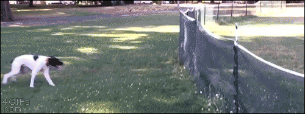

I'm heading to [XOXO](http://xoxofest.com) this weekend. It's my first time, and I'm very excited. I typically live by my Calendar software and I always love it when events have something I can add straight into my app. To help me out this time at XOXO I made a bunch of public calendars for the different tracks of activities.

Feel free to subscribe to them. I'm a Calendar.app user, sorry for you Google Calendar users out there.

## How Do I Add Them?

### Step 1: Click The Link You Want To Add

It should open your Calendar.app and open a confirmation dialog to subscribe to the calendar.

- [Arcade](webcal://p03-calendars.icloud.com/published/2/5t3l9_xtumrjecu7G6M6WWugLRYaAgA0NJ8bFGASgyyAiipyq2zUXoENQ6W02AAGBsiKAc8q6AzjtqgWYOkiLBE5ZBRdedpJiimDBSylrO4)
- [Socials](webcal://p03-calendars.icloud.com/published/2/0eCSZGGxNR0Ia9QLT7mlwFGHTm5TPztwVGdNyi6ZwCA6IajySNwtLT5LjMoqobJvGBafGpf3hz0PJllmzjcbK0K2QOPl2maqG7bIXCGuBmA)
- [Day Festival](webcal://p03-calendars.icloud.com/published/2/27_5xpsmEi-wQnMbd3tL6vLE7d5h3Z37dXFUWl6CXM1C8QNzPXMABtre2m8YF2HQ2IohT0u5BR4ll_4KXW6LDMgL2WhOf8Nc22gZV0IPHjI)
- [Music](webcal://p03-calendars.icloud.com/published/2/jqM3QZx0m1wILRsyJcqT2shjI6cZIMwwMK6gaAM72qXoiZcUo6UsQK1SiCAkQLNORB6ZvzLJ5Xudc6MOmvBT31PqPeYoAS_PFN-UK2AkvCY)
- [Story](webcal://p03-calendars.icloud.com/published/2/J-SFcgXjCjQJrm-BKnmxxggqlmwcYEj0UWsmsMz5cEMU_1WY6EH68G6udExMXk3kGEIM_TNye3CrZGzKwzJW4DZR0orfytNY1InnWhyeYhQ)
- [Tabletop](webcal://p03-calendars.icloud.com/published/2/9KN-w5OXOEnCQGw052p2qlC4Z5e2XntGDDmZer7NPusyUp7oMRAPZagBQNYPVOShyiMM8FufVjG_SWMLa8tdwNLCWVHIZBUO9AgxajvwjT0)
- [Film & Animation](webcal://p03-calendars.icloud.com/published/2/bN0TRBavjdqXZb6wHfvolMHeDX2sDmRutNLQ7FOQfvMiAmW7M_d-l9TKAudy--NUWdVeX6G2IC6xbSRjTbUtUGAo9DrcA2zrLmEtV7kudzU)

### Step 2: Continue With Your Day

