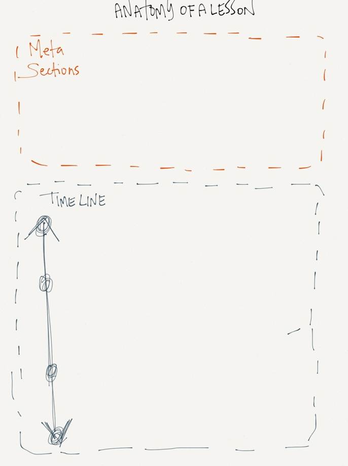
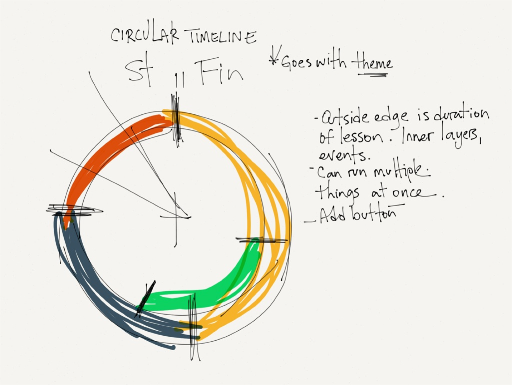
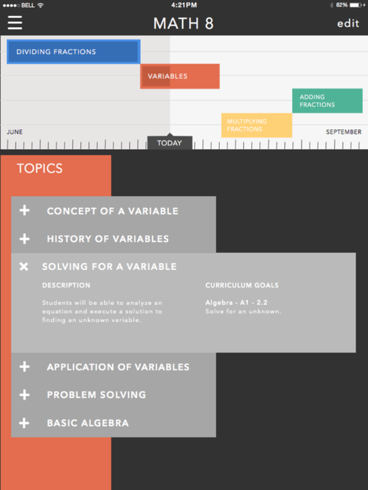
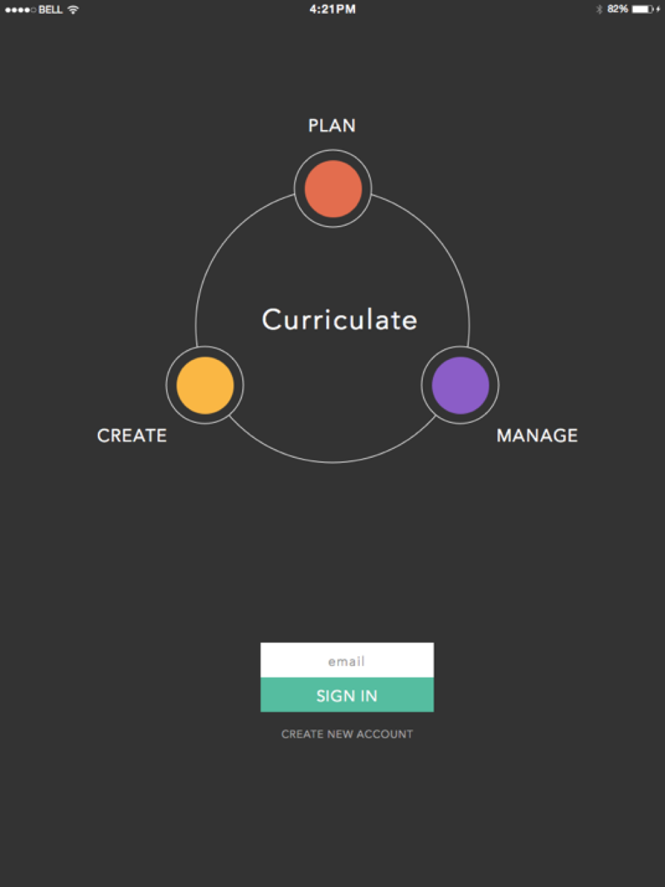

My background in teaching has motivated me to begin work/ on this project. It's a tool for planning, managing and sharing lesson plans. I started with the idea and went from there, asking myself all the Why questions I could before starting to sketch.

### Information Architecture
From sketches I began to create a userflow and wireframes.
Once the information architecture and wireframing process was complete I started with the visual design process, originally starting with an iPad-centric experience in mind.

### Design
Teachers use their desktop computers, their iPads, smartboards and whatever interfaces they can get their hands on to teach a lesson so it made more sense to start developing a responsive web app. Being able to use the app from anywhere is a must for the user.
The following iterations brought me to the final mockups I have begun to use for the prototype development.

The project is still early in the development stage, I'll hopefully have something live linked here soon.

