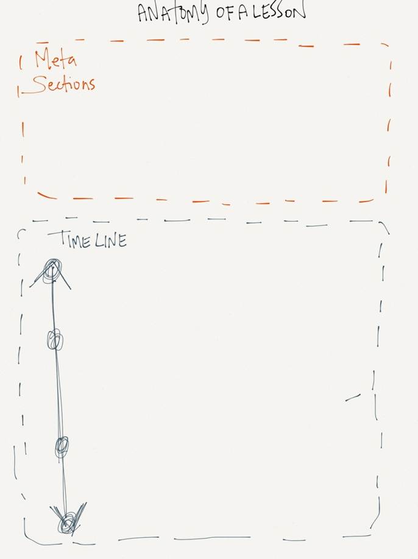
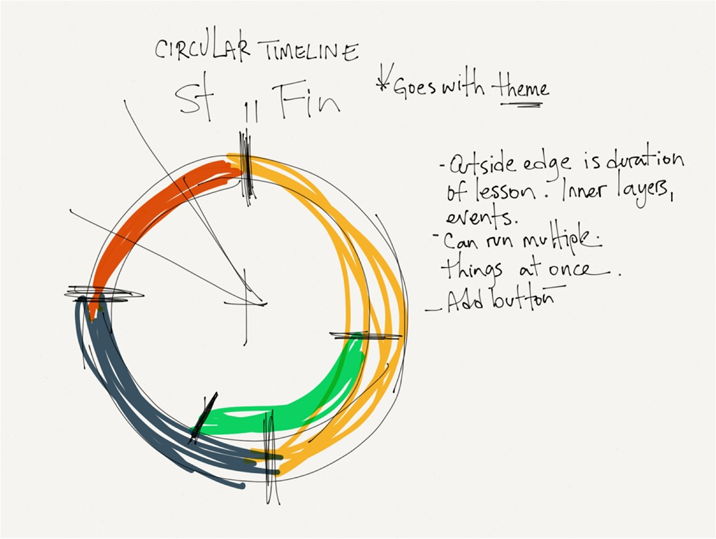
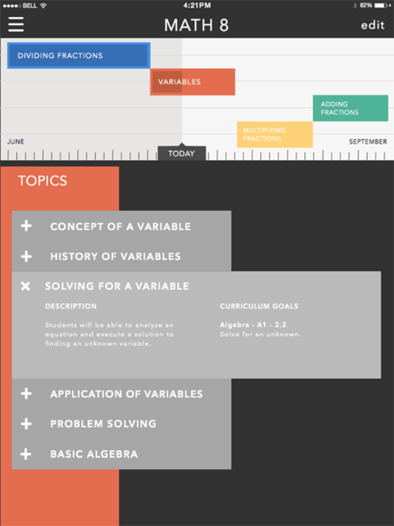
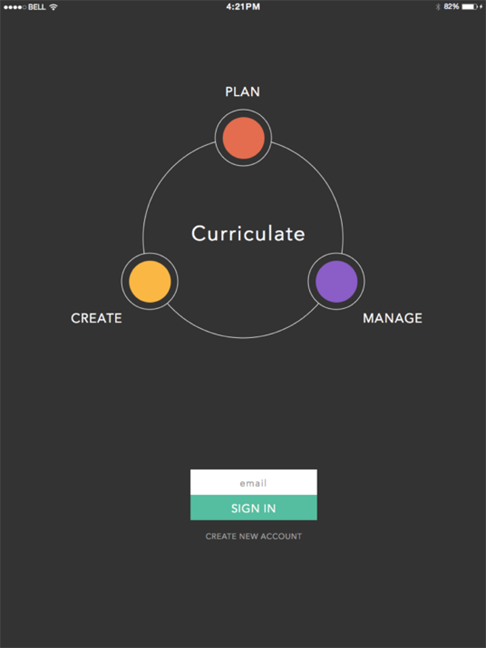
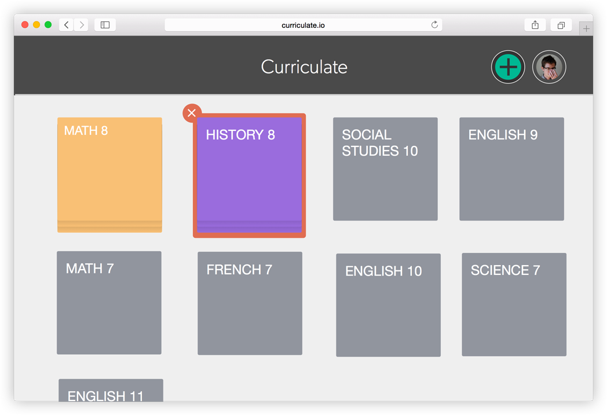
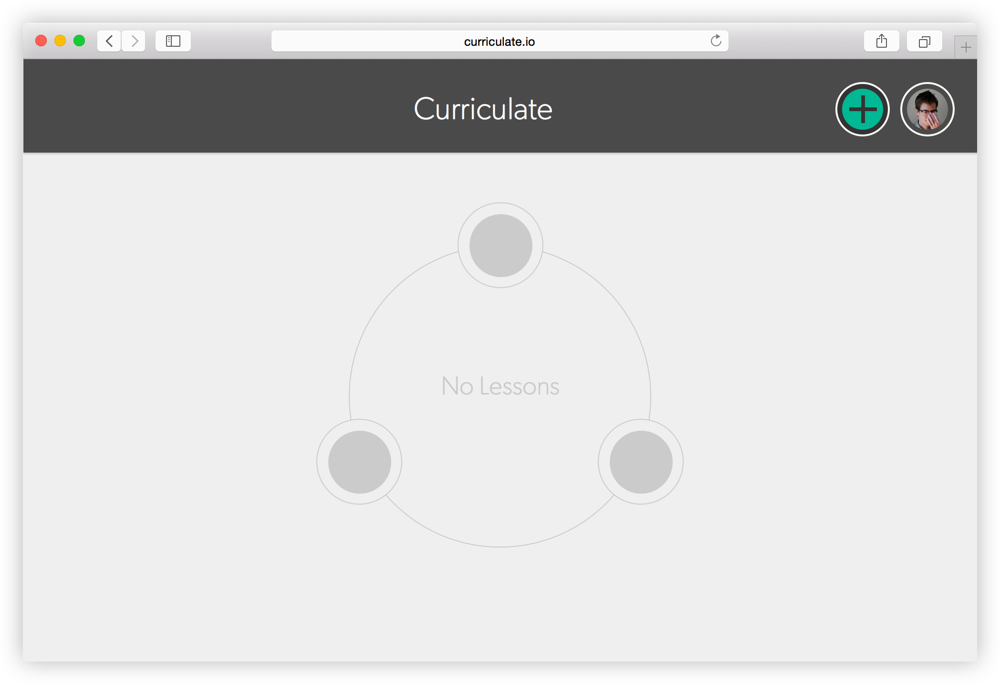
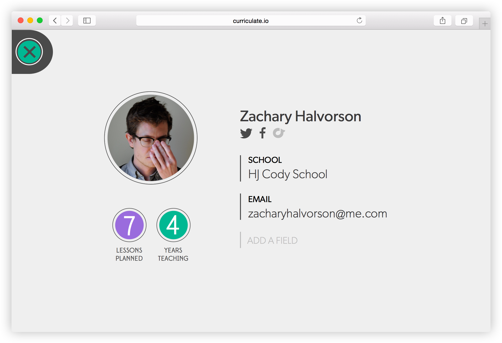
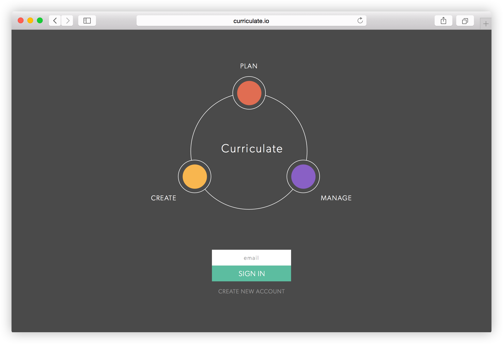

This project is a work in progress that began while I was at University. I have a background in teaching, and the current state of tools for teacher to plan, and present lesson was lacking to say the least.

My process began by defining the set of problems I was looking to help solve - the core issue I was addressing was that the tools teachers use to plan are different from the ones they use to present. There's a migration that always needs to happen. A lot of points where the process could be more efficient.

When teaching a class, its usually very helpful to have a timeline of the lesson. A chronological list of activities that, if all goes as planned, get you to your expected outcome. Most teachers keep this in the form of a piece of paper, or a word document they look at on their desktop computer before class. It's essentially like presenters notes, but not necessarily tied to a slideshow.

So with that timeline in mind I started with a lot of sketches, trying to imagine an interface that could help teachers develop their timelines and then use that same tool to help guide their lessons.

There were quite a few iterations on that timeline. The design started to shift toward bold colors, and high contrast. In the context of a classroom, being able to quickly glance at a screen and understand your plan was key. Teachers wouldnt have much time to be scanning an interface for the information they needed while trying to stay engaged with the class.

The iterations eventually led me to some mocks which gave me a place to start building prototypes. This is, unfortunately, still a work in progress. Hopefully have time to give to it soon.

