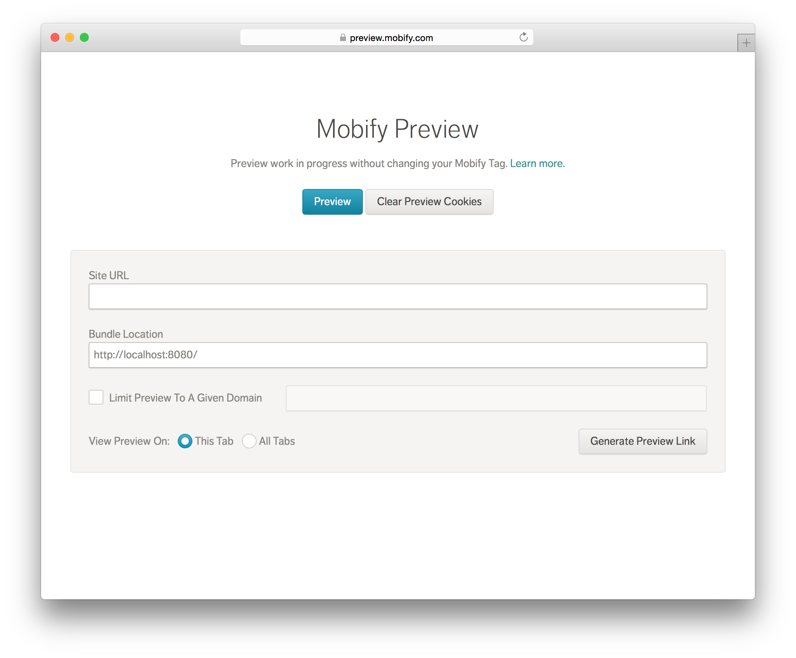

Mobify Preview is a tool used by developers around the world to test and share their work on Mobify projects. It provides the ability to locally preview changes to a website for a small screen without altering the code in production.

### User Testing

This tool is widely used by many different agents on a typical Mobify project, from developers, to Project Managers, to client stakeholders. My research into the use of this product I inherited had to be discreet, not to pull clients into something that could potentially negatively impact our relationship.

### Getting Started

At the beginning of this project, we asked ourselves, "What would 1-click preview look like?". After analyzing all the different workflows, we came up with multiple solutions that could shorten the time to preview for a typical user. Here's what it looks like for a developer to use preview locally.

I did a lot of in-person interviews with customer-facing people within the company gain insight into how preview was used. I ended up making an <a class="c-link" href="https://github.com/zacharyhalvorson/alfred-audio">Alfred workflow</a> for quickly starting audio recordings.

