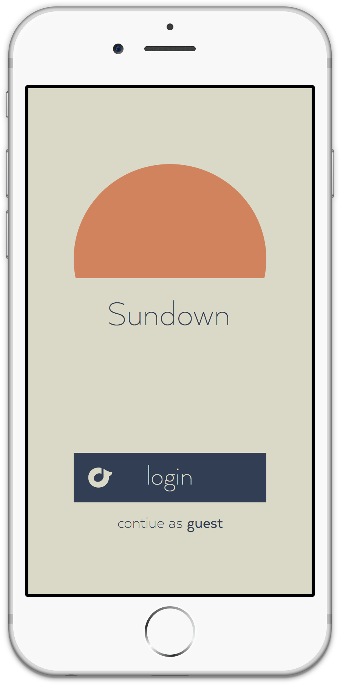
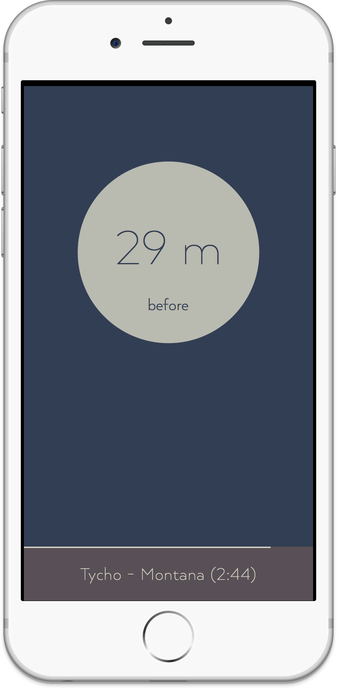
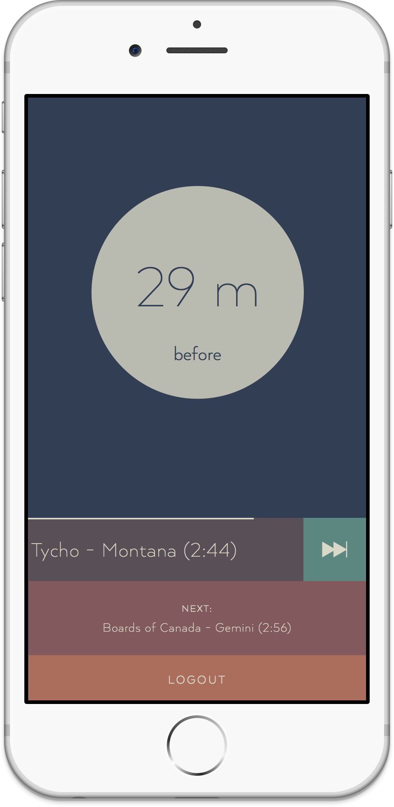

Sundown is envisioned as a way for people to be reminded of the sunset and provide appropriate music for it's enjoyment. The user is kept apprised of how many minutes away the sunset is based on their location and, at a specified time, play a pre-organized sunset-themed playlist.

### Design
The interface is meant to compliment but not distract from the beautiful sunset the users are meant to be enjoying. The darker background more relaxing to read in dark light, no one wants a face full of white light while they’re trying to appreciate a beautiful sunset.

### Development
I plan to continue to develop this app in Xcode and launch it for free in the app store - open to any Rdio users with an option for non-Rio users to try it out as a guest. I’ve currently got a Framer JS prototype that you can check out [here](http://zacharyhalvorson.github.io/Sundown-Framer), go ahead and give it some swipes. And if you happen to be curious how many minutes you are away from the sunset, go ahead and click [here](http://zacharyhalvorson.com/Sundown-Web/clock).

